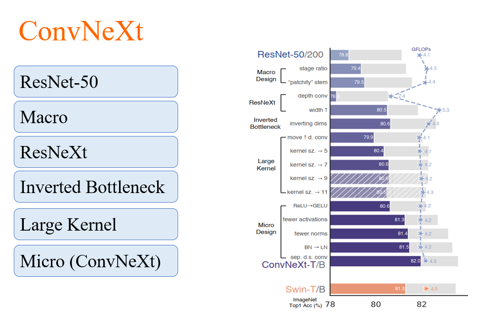
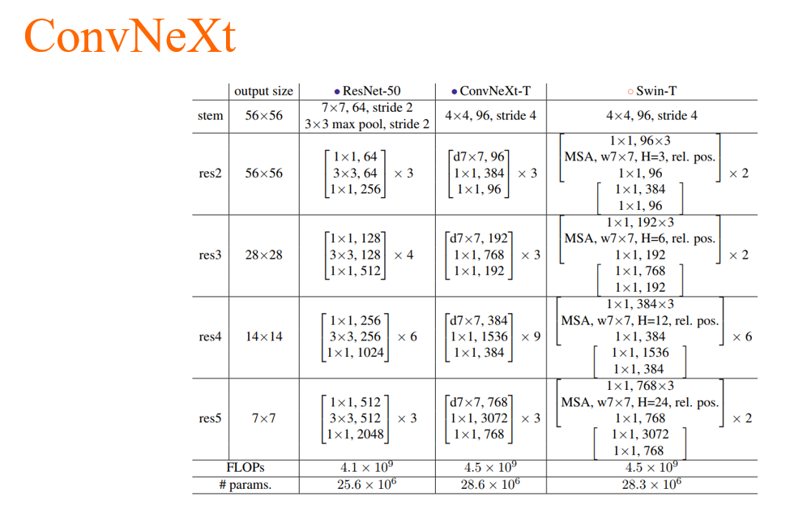

# A ConvNet for the 2020s

Our implementation of paper: [A ConvNet for the 2020s](https://arxiv.org/abs/2201.03545), using [tensorflow 2](https://www.tensorflow.org/)

<p align="center">
    
</p>

This library is part of our project: Building an AI library with ProtonX

ConvNeXt Architecture :

<p align="center">
    
</p>

<p align="center">
    
</p>

Authors:
- Github: thinguyenkhtn
- Email: thinguyenkhtn@gmail.com

Advisors:
- Github: https://github.com/bangoc123
- Email: protonxai@gmail.com

## I.  Set up environment
- Step 1: Make sure you have installed Miniconda. If not yet, see the setup document [here](https://conda.io/en/latest/user-guide/install/index.html#regular-installation).

- Step 1: Clone this repository: `git clone https://github.com/protonx-tf-04-projects/ConvNext-2020s`

## II.  Set up your dataset

<!-- - Guide user how to download your data and set the data pipeline  -->
1. Download the data:
- Download dataset [here](https://storage.googleapis.com/mledu-datasets/cats_and_dogs_filtered.zip)
2. Extract file and put folder ```train``` and ```validation``` to ```./data``` 
- train folder was used for the training process
- validation folder was used for validating training result after each epoch

This library use ImageDataGenerator API from Tensorflow 2.0 to load images. Make sure you have some understanding of how it works via [its document](https://keras.io/api/preprocessing/image/)
Structure of these folders in ```./data```

```
train/
...cats/
......cat.0.jpg
......cat.1.jpg
...dogs/
......dog.0.jpg
......dog.1.jpg
```

```
validation/
...cats/
......cat.2000.jpg
......cat.2001.jpg
...dogs/
......dog.2000.jpg
......dog.2001.jpg
```

<!-- - References: [NLP](https://github.com/bangoc123/transformer) and [CV](https://github.com/bangoc123/mlp-mixer) -->

## III. Training Process

Review training on colab:

<a href="https://colab.research.google.com/drive/1nKz8n11atRgP_TkIoixEVSYVhyhAC5qN?usp=sharing"> </a>

Training script:

```python

python train.py --epochs ${epochs} --input-lang en --target-lang vi --input-path ${path_to_en_text_file} --target-path ${path_to_vi_text_file}

```

Example:

```python

!python train.py --train-folder ${train_folder} --valid-folder ${valid_folder} --num-classes 2 --image-size 224 --lr 0.0001 --model tiny --epochs 30

``` 

There are some important arguments for the script you should consider when running it:

- `train-folder`: The folder of training data
- `valid-folder`: The folder of validation data
- `model-folder`: Where the model after training saved
- `num-classes`: The number of your problem classes.
- `batch-size`: The batch size of the dataset
- `image-size`: The image size of the dataset
- `lr`: The learning rate
- `model`: Type of ConvNeXt model, valid option: tiny, small, base, large, xlarge

## IV. Predict Process

```bash
python predict.py --test-data ${link_to_test_data}
```

## V. Result and Comparision

Your implementation
```
Epoch 195: val_accuracy did not improve from 0.81000
63/63 [==============================] - 74s 1s/step - loss: 0.1756 - accuracy: 0.9300 - val_loss: 0.5760 - val_accuracy: 0.7930
Epoch 196/200
63/63 [==============================] - ETA: 0s - loss: 0.1788 - accuracy: 0.9270
Epoch 196: val_accuracy did not improve from 0.81000
63/63 [==============================] - 74s 1s/step - loss: 0.1788 - accuracy: 0.9270 - val_loss: 0.5847 - val_accuracy: 0.7890
Epoch 197/200
63/63 [==============================] - ETA: 0s - loss: 0.1796 - accuracy: 0.9290
Epoch 197: val_accuracy did not improve from 0.81000
63/63 [==============================] - 74s 1s/step - loss: 0.1796 - accuracy: 0.9290 - val_loss: 0.5185 - val_accuracy: 0.7840
Epoch 198/200
63/63 [==============================] - ETA: 0s - loss: 0.1768 - accuracy: 0.9290
Epoch 198: val_accuracy did not improve from 0.81000
63/63 [==============================] - 74s 1s/step - loss: 0.1768 - accuracy: 0.9290 - val_loss: 0.5624 - val_accuracy: 0.7870
Epoch 199/200
63/63 [==============================] - ETA: 0s - loss: 0.1744 - accuracy: 0.9340
Epoch 199: val_accuracy did not improve from 0.81000
63/63 [==============================] - 74s 1s/step - loss: 0.1744 - accuracy: 0.9340 - val_loss: 0.5416 - val_accuracy: 0.7790
Epoch 200/200
63/63 [==============================] - ETA: 0s - loss: 0.1995 - accuracy: 0.9230
Epoch 200: val_accuracy did not improve from 0.81000
63/63 [==============================] - 74s 1s/step - loss: 0.1995 - accuracy: 0.9230 - val_loss: 0.4909 - val_accuracy: 0.7930
```

## VI. Feedback
If you meet any issues when using this library, please let us know via the issues submission tab.


